# 이미지 조사 및 선정

## 선호 캐릭터 조사

### 대상

- 초등학생 학부모 2인
- 유치원생 및 유아 학부모 1인
- 초등학교 사서 겸 초등학생 학부모 1인
- 초등학교 교사 2인
- 중학교 교사 1인
- 예비학부모 3인
- 기타 일반인 6인

### 순서

1. 최근 선호하는 영유아 및 초등학생의 선호 캐릭터 온라인 조사
2. 지인을 통한 정보 탐색 - 동물 및 공룡을 선호하며, 정확하게 어떤 캐릭터인지 확인할 수 있는 것을 선호함
3. 유사 이미지 탐색 및 권한 조회
4. 관계자 투표
5. 캐릭터 선택

### 캐릭터 후보

<left>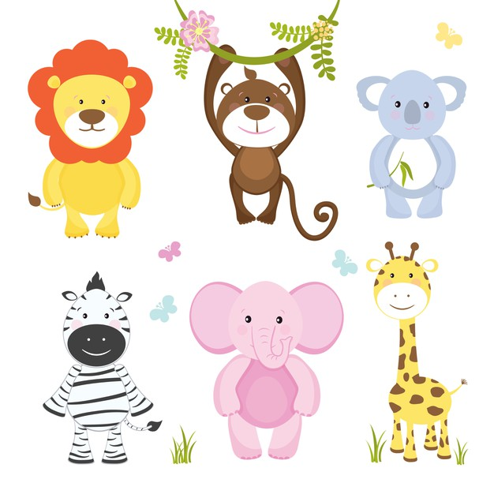</left>

<left>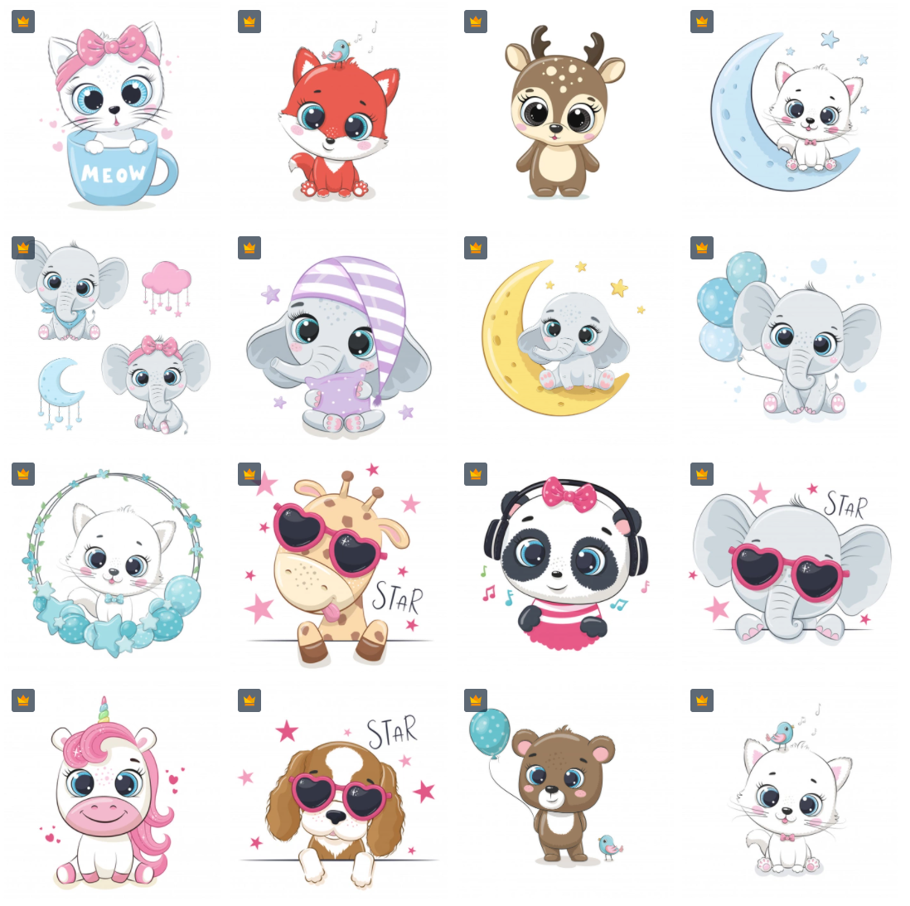</left>

<left>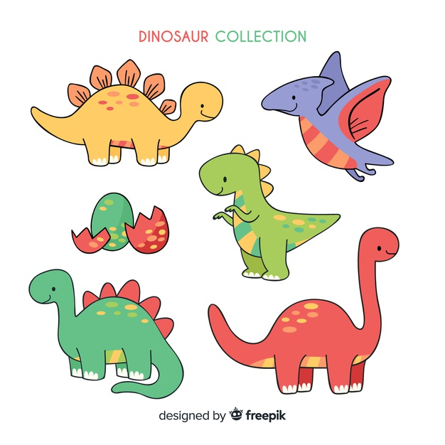</left>

***

## 알파벳 이미지 조사

### 탐색

- 선정된 캐릭터와 어울리는 알파벳 이미지 조사

### 후보

- 1차로 20개의 테마에서 4개의 아이템 선택

- 선택된 알파벳 이미지를 추출 후 캐릭터 및 배경에 어울리는 알파벳 이미지 선정

  <left>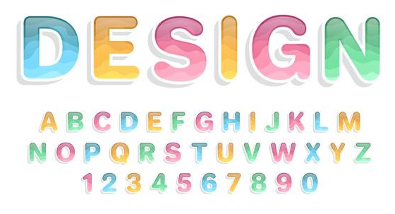</left>

  <left>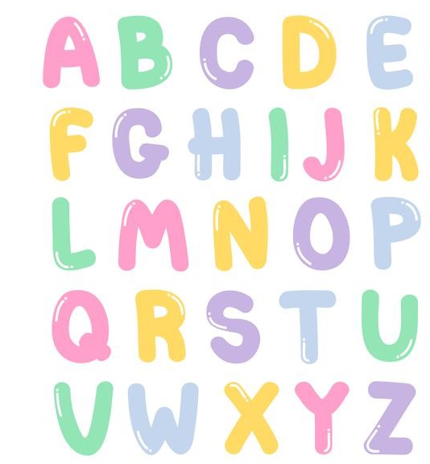</left>

  <left>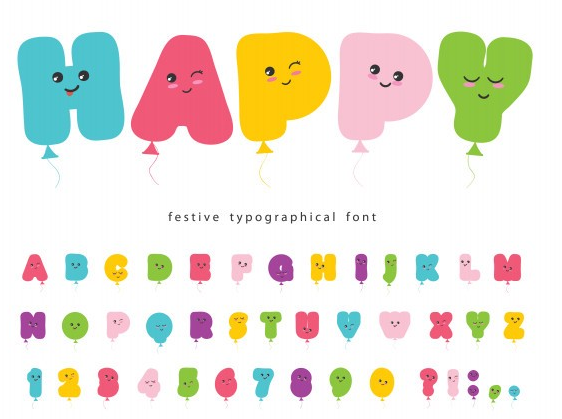</left>

  <left>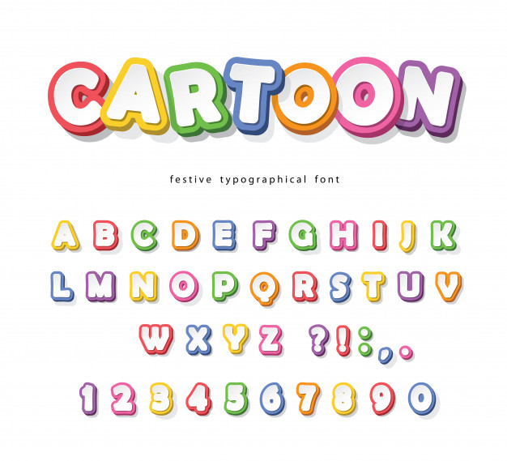</left>

***

## 배경 이미지 조사

### 탐색

- 선정된 캐릭터 및 알파벳과 유사하고 화면 UI/UX와 어울리는 배경 이미지 조사

### 후보

-  [후보 리스트](https://www.notion.so/2e6bdd9df24945d2893adc099354fad7)

### 선정된 배경이미지

<left>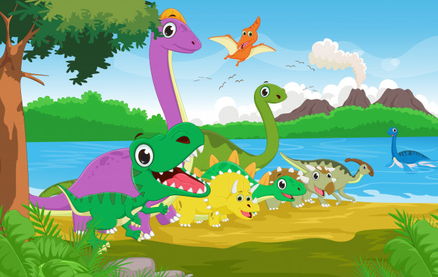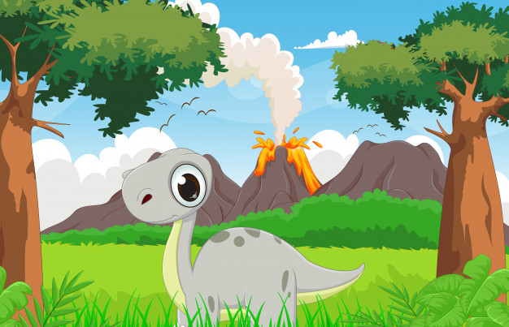</left>

<left>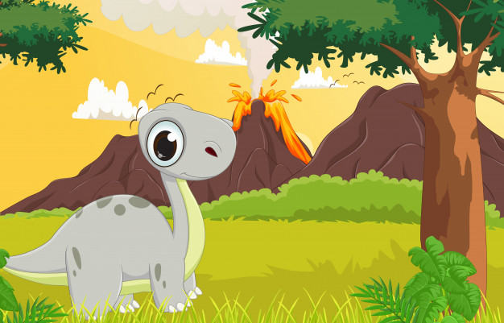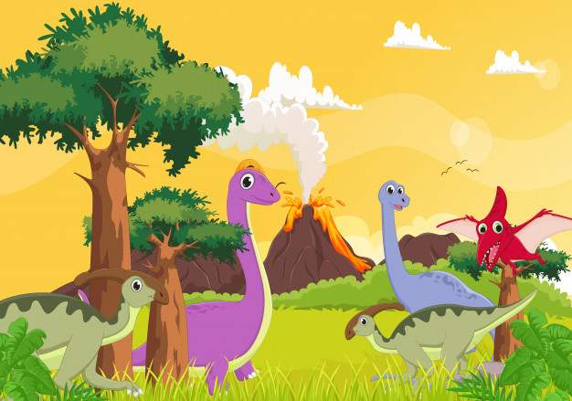</left>