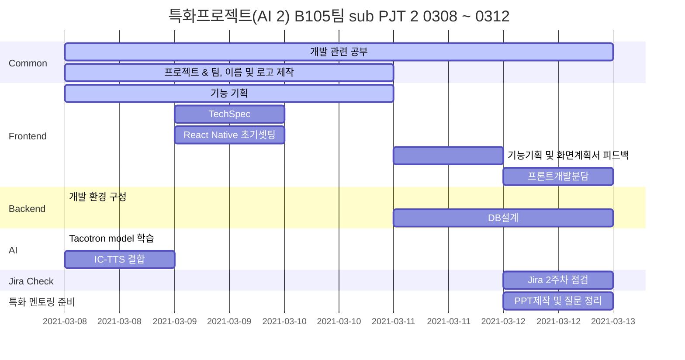

## AI 그림 일기를 활용한 영어 학습 어플 (가제)

> 6-7세를 위한 AI 캡셔닝을 활용해 영어 일기 작성으로 영어 문장 및 단어 학습 어플


## 👨‍👩‍👧‍👧 **팀원 소개**

|    이름    | 직책 |                 역할                  |
| :--------: | :--: | :-----------------------------------: |
| **명도균** | 팀장 | Frontend, 기획 ,UCC 제작, README 작성 |
| **신민호** | 팀원 |         Frontend, 회의록관리          |
| **유진우** | 팀원 |     Frontend, Git master, Design      |
| **윤지해** | 팀원 |        Frontend, QA, JIRA 관리        |
| **장수민** | 팀원 |         Backend(DB), AWS관리          |
| **전의수** | 팀원 |   Backend (AI), 테크리더, UCC 제작    |


## 🔨 Tech Stack

#### ⭐ Front-end :     

#### ⭐ Back-end :   

#### ⭐ Common :   


## 🚩 Gantt Chart



## 🗿 MileStone

1.  3/16 : (화면정의서, 와이어프레임 및 디자인) 기획 완료, DB 설계 완료
2.  3/17 : FE 개발 시작, AI 모델 학습 시작,  BE 개발 시작
3.  3/19 : sub2 발표
4.  3/24 : 주요기능 (영어일기, 단어장, 회원관리) 개발 완료 , 추가기능 (계정설정 및 통계 기능) 개발 시작
5.  3/31 : 1차 배포 및 디자인 핵심 기능 점검
6.  ~ 4/6 : 테스트코드 실행 및 QA
7.  ~4/8 : 리드미 작성 및 UCC 제작


## 📌 개발 규칙

#### 📝 Commit message

```
예시 :

[feat/FE] : 제목
##### 제목은 최대 50 글자까지만 입력 ############## -> |
내용
######## 본문은 한 줄에 최대 72 글자까지만 입력 ########################### -> |
```

```
feat       : 새로운 기능 추가
fix        : 버그 수정
refactor   : 코드 리팩토링
style      : 코드 포맷팅, 세미콜론 누락, 코드 변경이 없는 경우
docs       : 문서 수정
test       : 테스트 코드, 리팩토링 테스트 코드 추가
chore      : 빌드 업무 수정, 패키지 매니저 수정
 ------------------
#     제목 첫 글자를 대문자로
#     제목은 명령문으로
#     제목 끝에 마침표(.) 금지
#     제목과 본문을 한 줄 띄워 분리하기
#     본문은 "어떻게" 보다 "무엇을", "왜"를 설명한다.
#     본문에 여러줄의 메시지를 작성할 땐 "-"로 구분
```


#### 🌲 Branch

- master

- develop

- 문서일 경우 : docs/[name]-[status]

- 수정할 경우 : hotfix/[part]-[name]

- 기능 : feature/[part]-[name]-[status]

  - \*part : FE or BE

  - \*name : 기능 등 자유

  - \*status : 기능을 한 번에 완성하지 못했을 경우 추가로 할 때

    (ex. init, second, processing, end)


#### 💻 Code

- 전체 format
  - ESLint, prettier 사용
- naming
  - Django(Python)
    - Snake case (ex. snake_case) : 변수, 함수, 메소드
    - Pascal case (ex. PascalCase) : 클래스
  - React-native
    - Pascal case (ex. PascalCase) : 클래스
    - Camel case (ex. camelCase) : 기타


## 🎨 주요 기능

#### 🔑 기획 배경

- AI 기술과 결합하여 올바른 문장구조를 학습하고 단어를 잘 사용할 수 있는 것을 목적으로 함
- 단어의 수가 중요한게 아니라 단어를 맥락에 맞게 문장으로 구성할 수 있는 능력이 중요
- 시중의 영어 앱은 스피킹 & 단어 암기, 게임 방식의 영어 앱
- 영어 단어를 활용하여 문장 구사가 가능 하고 올바른 문장 구조 및 단어 활용 연습이 필요한 아이를 타겟
- 개인 수준별 학습된 영어 지식을 활용하여 일기를 작성할 수 있는 어플


#### 📝 앱 실행 시 주의사항 고지

- 앱 사용 주의사항 고지 (데이터 과금, AI 사진 데이터 사용(상업용으로 사용되지 않음) 등)


#### 📝 회원 관리

- **회원가입**

  - 이메일 인증으로만 회원가입
  - 아이디 + 비밀번호
  - 계정생성 화면으로 넘어감
  - 엄마 계정 핀 번호 생성

- **계정생성**

  - 아이 이름

  - 나이(생년)
  - 프로필 선택 (캐릭터 몇 개 선택지 줄 예정)
  - 회원가입 시 충족되어야 하는 기준에 대한 명확한 안내 기능 **(아이디 이메일 형태 입력, 비밀번호 (대소문자(영어) + 숫자 조합 8자리 수 확인 등)**

- **다중 프로필 생성 기능** (아이가 2명 이상인 경우를 위해서)

- **로그인**

  - PW 찾기 기능(이메일로)
  - 로그인 실패시 오류 메세지 출력 기능
  - 로그인 후 자녀 프로필 선택 페이지로 이동

- **프로필 선택 페이지**

  - 자녀 프로필 선택 후 서비스 메인페이지로 이동


#### 📝 메인페이지

- **튜토리얼**
  - 회원 가입시 처음 나타남.
  - 전체적인 홈페이지 사용 방식에 대해서 짧게 설명
  - 마지막에 설명 다 되면 일기 쓰러가기 버튼 활성화 (일기장으로 이어짐)
- **메뉴 선택 페이지**
  - 그림일기쓰기
  - 일기장보기
  - 내 단어장 보기(단어학습기능도)
  - 계정 설정
- **메인페이지 고정해야할 아이콘**
  - 튜토리얼 다시보기 아이콘
  - 엄마공간(?)으로 가는 아이콘
  - 배경음악 음소거 아이콘


#### 📝 **AI 캡셔닝 일기 작성**

- **일기 작성 페이지 상단에 일기 작성 방법 설명서를 볼 수 있는 기능**

- **작성되는 일기가 첫 일기라면 튜토리얼로 사용방법을 익히며 첫 일기 작성**

- **그림일기 사진 첨부 기능**

  - 사진은 일기당 1장만 첨부 가능
  - 사진 첨부 후 AI 캡셔닝까지 약간의 시간이 걸릴 경우 사용자에게 알리는 기능
  - 카메라 활용해 직접 사진을 찍고 첨부할 수 있는 기능

- **캡셔닝 제공 기능**

  - 캡셔닝 된 단어를 보여주는 기능(영어 단어들이 나열됐을 때 단어를 클릭하면 단어가 뒤집히며 한글 뜻을 볼 수 있음 1초 후 다시 영어 단어로 돌아옴) + 단어를 읽어주는 기능
  - 캡셔닝이 불가능하다면 다른 사진 첨부를 유도하거나 다시 첨부해달라는 메세지 출력 기능

- **일기 작성 기능**

  - 제목 작성
  - 타이핑도 가능하고 기본적으로 터치패드에 직접 글씨를 써서 입력하는 방식을 디폴트로 함
  - 글자 입력하는 터치패드 위나 아래에 타이핑 아이콘 추가
  - 위의 경우 작성된 글씨를 타이핑 글씨체로 변환해주는 기능
  - 일기를 아무것도 쓰지 않거나 캡셔닝 된 단어의 일정 수준 (1/3의 단어만 적었을 경우 등)이하로 적었을 경우 일기가 작성되지 않음(최소한 한 문장은 작성해야함)
  - 일기 작성에 어려움을 겪는 아이들을 위해서 AI 단어 추천 기능 혹은 나이별 많이쓰는 단어 100개 등을 제공해서 선택해서 작성 할 수 있도록 유도 > **일기 작성 칸에 캐릭터를 누르면 도움을 주거나 힌트를 주는형식으로 제공** "내가 도움을 줄게!!"(모달로 제공!!!!!!!(꼭 지켜주세요))
  - 일기 작성 시 모르는 단어나 추가할 단어가 있으면 단어 추가하는 기능 **(아래 단어장과 연결됨)** 드래그앤 드롭.

- **작성된 일기 문법 오류 찾아주는 기능 (grammer check)**

  - 일기 작성 중 문법에 맞지 않거나 단어의 철자가 틀린 경우 빨간색이나 직관적이게 오류를 출력해 수정할 수 있도록 하는 기능

- 일기 작성 저장이 끝나면 "00이의 00번째 일기가 완성되었어요!!!"라고 안내해주는(멘트는 수정 가능) 알림이 나옴

- **메인화면으로 이동**

- 중간에 일기 작성 중에 다른 페이지로 이동하면 저장되지 않는다라는 안내 후 이동할 수 있게 주의 사항 안내


#### 📝 내 단어장 기능

- **일기 작성 중 모르는 단어 혹은 단어장에 추가하고 싶은 단어들을 단어장에 추가.**

- **단어장의 단어는 A~Z 순으로 폴더가 만들어져있고 클릭하면 해당 알파벳으로 시작하는 단어 카드들이 나옴**

- **중복된 단어(이미 단어장에 들어가 있는 단어)는 추가하지 못하는 기능 추가**

- **단어 저장은 단어, 뜻, 형태에 대한 충분한 정보가 같이 저장**


#### 📝 일기장

- **일기장 목록 (이제까지 쓴 일기장 보기)**
  - 1개월 단위로 한 달이 지나면 이미지+ 일기 제목 카드 형식으로 묶이고, 해당월 일기는 쭉 나열해서 타임라인 형식으로 보여줌
  - 이전 달은 달을 클릭하면 앨범 형식으로 책 넘기는 느낌으로 제작 (한 페이지에 4~6개씩 카드가 들어가서 볼 수 있게)
  - 날짜별, 혹은 타임라인별 (해당월은 타임라인, 나머지는 월별로 몇 개 이런식으로 보여주는 방법도 생각)
  - 일기 삭제 기능 (조금 더 생각해 볼 만한 기능)
- **일기 조회**
  - 특정 일기 카드를 선택하면 작성한 일기를 볼 수있음


#### 📝 계정 설정 기능

- **계정 설정**
  - 내 캐릭터 변경
  - TTS (음성 합성 목소리 설정 등)


#### 📝 엄마 화면 기능(핀번호 인증으로 들어갈 수 있음)

- **학습 데이터 조회 페이지**
  - 다중계정인 경우 계정별 조회할 수 있음
  - 작성된 일기 수(빈도), 사용한 단어 수 , 단어장에 추가한 단어 수
  - 아이 일기 조회 가능
  - 아이 일기에 칭찬도장을 찍어줄 수 있음(도장 종류 2~3개)
- **계정 변경 페이지**
  - 다중 프로필이 존재할 때 다른 프로필로 이동할 수 있음
  - 계정 삭제 기능
- **계정 설정**
  - 비밀번호 변경
  - 핀 번호 변경
- **로그아웃 기능**


#### 💻 후순위 개발 기능

- **계정 변환 부분**
- **Speaking & Reading 작성 완료 후 스피킹, 리딩 파트로 넘어감**
- 일기 작성과 문법 오류 수정이 끝난 일기라면, 작성된 일기를 TTS적용해 들어보고 따라하는 기능
- 문장단위로 옆에 듣기 버튼이 활성화되고, 클릭하면 해당 문장을 듣고 문장 단위로 녹음할 수 있음.
- 하나 이상의 문장은 녹음해야지 최종적으로 그림 일기가 저장됨
- 내가 말하는 내용을 녹음해 발음 유사도를 평가해볼 수 있는 기능
- 아이의 발음과 비교하여 점수 부여 > 보상과 연계하여 보상
- 일정 유사도가 나오지 않으면 캐릭터가 "다시해봐!!!" 라고 안내
- 단어장을 활용하여 단어 복습하는 기능 추가
- 검색기능도 시간 봐서 추가


