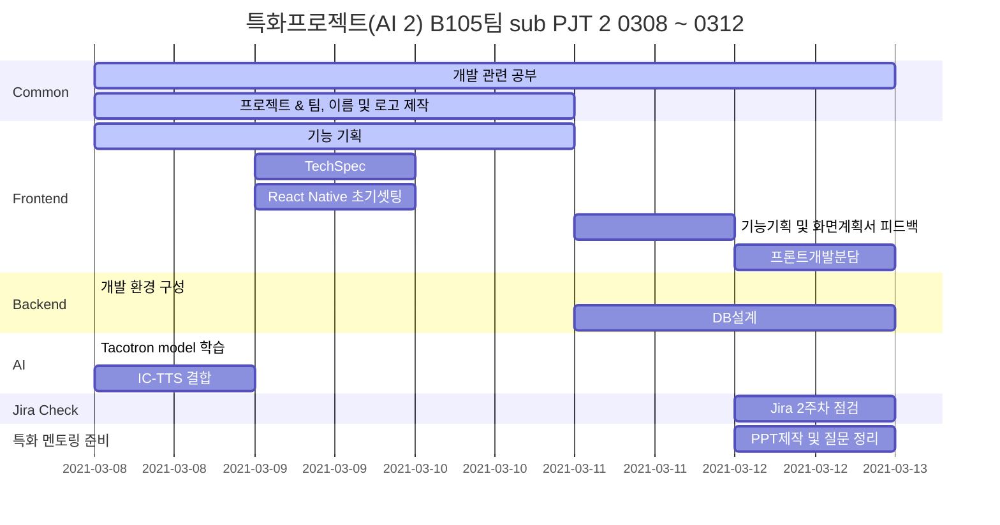

##  AI 그림 일기를 활용한 영어 학습 어플 (가제)

> 6-7세를 위한 AI 캡셔닝을 활용해 영어 일기 작성으로 영어 문장 및 단어 학습 어플 

## 👨‍👩‍👧‍👧 **팀원 소개**

|    이름    | 직책 |                 역할                  |
| :--------: | :--: | :-----------------------------------: |
| **명도균** | 팀장 | Frontend, 기획 ,UCC 제작, README 작성 |
| **신민호** | 팀원 |         Frontend, 회의록관리          |
| **유진우** | 팀원 |     Frontend, Git master, Design      |
| **윤지해** | 팀원 |        Frontend, QA, JIRA 관리        |
| **장수민** | 팀원 |         Backend(DB), AWS관리          |
| **전의수** | 팀원 |   Backend (AI), 테크리더, UCC 제작    |

## 🔨 Tech Stack

#### ⭐ Front-end :     

#### ⭐ Back-end :   

#### ⭐ Common :   

## 🚩 Gantt Chart

## 🎨 주요 기능

#### 🔑 기획 배경

- AI 기술과 결합하여 올바른 문장구조를 학습하고 단어를 잘 사용할 수 있는 것을 목적으로 함

- 영어 단어를 활용하여 문장 구사가 가능 하고 올바른 문장 구조 및 단어 활용 연습이 필요한  6-7세를 타겟으로 함

- 단어의 수가 중요한게 아니라 단어를 맥락에 맞게 문장으로 구성할 수 있는 능력이 중요

- 시중의 영어 앱은 스피킹 & 단어 암기, 게임 방식의 영어 앱

- 개인 수준별 학습된 영어 지식을 활용하여 일기를 작성할 수 있는 어플

  

#### 📝 앱 사용 방법 및 튜토리얼

- 튜토리얼(사용 방법) - 회원가입 후 바로 이어지는 화면 ( 화면 상단에 다시 볼 수 있도록 재생 버튼 혹은 더보기 버튼으로 고정)
- 앱 사용 주의사항 고지 (데이터 과금, AI 사진 데이터 사용(상업용으로 사용되지 않음) 등)

#### 📝 회원 관리

- **회원가입**
  - 회원 가입 시 받아야 하는 정보
    - 아이 이름 (닉네임)
    - 나이
    - 프로필 사진
  - 회원가입 시 충족되어야 하는 기준에 대한 명확한 안내 기능 (아이디, 닉네임 중복 체크, 비밀번호 자리 수 확인 등)
- **로그인**
  - ID 찾기 기능
  - PW 찾기 기능
  - 로그인 실패시 오류 메세지 출력 기능

#### 📝 **AI 캡셔닝 일기 작성**

- **일기 작성 페이지 상단에 일기 작성 방법 설명서를 볼 수 있는 기능**

- **그림일기 사진 첨부 기능**

  - 사진은 일기당 1장만 첨부 가능
  - 사진 첨부 후 AI 캡셔닝까지 약간의 시간이 걸릴 경우 사용자에게 알리는 기능
  - 카메라 활용해 직접 사진을 찍고 첨부할 수 있는 기능

- **캡셔닝 제공 기능**

  - 캡셔닝 된 단어를 보여주는 기능
  - 캡셔닝이 불가능하다면 다른 사진 첨부를 유도하거나 다시 첨부해달라는 메세지 출력 기능

- **일기 작성 기능**

  - 타이핑도 가능하고 기본적으로 터치패드에 직접 글씨를 써서 입력하는 방식을 디폴트로 함
  - 위의 경우 작성된 글씨를 타이핑 글씨체로 변환해주는 기능
  - 일기를 아무것도 쓰지 않거나 캡셔닝 된 단어의 일정 수준 (1/3의 단어만 적었을 경우 등)이하로 적었을 경우 일기가 작성되지 않음
  - 일기 작성에 어려움을 겪는 아이들을 위해서 AI 단어 추천 기능 혹은 나이별 많이쓰는 단어 100개 등을 제공해서 선택해서 작성 할 수 있도록 유도
  - 일기 작성 시 모르는 단어나 추가할 단어가 있으면 단어 추가하는 기능 **(아래 단어장과 연결됨)**

- **작성된 일기 문법 오류 찾아주는 기능 (**grammer check)

  - 일기 작성 중 문법에 맞지 않거나 단어의 철자가 틀린 경우 빨간색이나 직관적이게 오류를 출력해 수정할 수 있도록 하는 기능

- **작성 완료 일기 읽어주는 기능**

   (Reading & Speaking)

  - 일기 작성과 문법 오류 수정이 끝난 일기라면, 작성된 일기를 TTS적용해 들어보고 따라하는 기능
  - 내가 말하는 내용을 녹음해 발음 유사도를 평가해볼 수 있는 기능

#### 📝 내 단어장 기능

- **일기 작성 중 모르는 단어 혹은 단어장에 추가하고 싶은 단어들을 단어장에 추가.**
- **중복된 단어(이미 단어장에 들어가 있는 단어)는 추가하지 못하는 기능 추가**
- **그림일기 별, 혹은 추가한 일자 별 일정 기준으로 단어장 정렬 가능, 단어장 내 추가한 단어 내 검색 기능**
- **단어 저장은 단어, 뜻, 형태에 대한 충분한 정보가 같이 저장**

  *++ (추후 추가 기능) 단어장을 활용하여 단어 복습하는 기능 추가*

#### 📝 계정 설정 기능

- **일기장 목록 (이제까지 쓴 일기장 보기)**
  - 그림일기위주이니, 사진첩 느낌도 괜찮을 것 같음
  - 날짜별, 혹은 타임라인별 (해당월은 타임라인, 나머지는 월별로 몇 개 이런식으로 보여주는 방법도 생각)
  - 일기 수정 및 삭제 기능 ( 조금 더 생각해 볼 만한 기능)
- **학습 데이터 목록**
  - 작성된 일기 수(빈도), 사용한 단어 수 , 단어장에 추가한 단어, 자주쓰는 단어 등등
  - 발음 유사도 학습 정도
- **계정 설정**
  - 닉네임, 비밀번호 변경, TTS (음성 합성 목소리 설정 등)