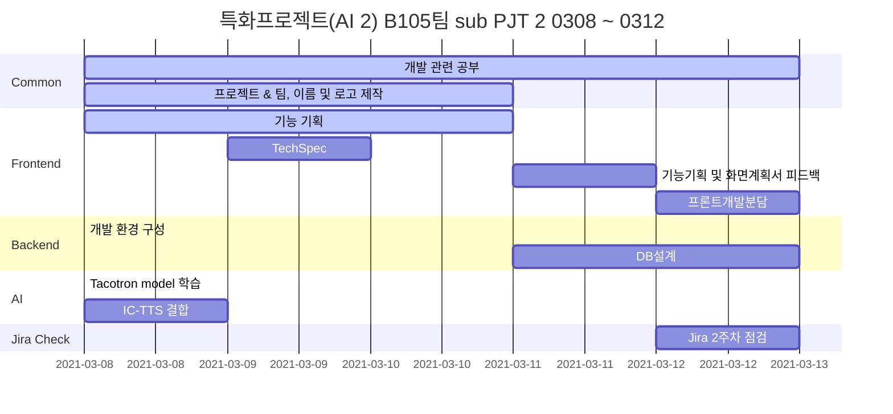

## 영/유아 AI 이미지 단어 교육 어플 (가제)

> 이미지 기반 AI 영/유아를 위한 영어 단어 학습 어플

## 👨‍👩‍👧‍👧 **팀원 소개**

|    이름    | 직책 |                 역할                  |
| :--------: | :--: | :-----------------------------------: |
| **명도균** | 팀장 | Frontend, 기획 ,UCC 제작, README 작성 |
| **신민호** | 팀원 |         Frontend, 회의록관리          |
| **유진우** | 팀원 |     Frontend, Git master, Design      |
| **윤지해** | 팀원 |        Frontend, QA, JIRA 관리        |
| **장수민** | 팀원 |         Backend(DB), AWS관리          |
| **전의수** | 팀원 |   Backend (AI), 테크리더, UCC 제작    |

## 🔨 Tech Stack

#### ⭐ Front-end :    

#### ⭐ Back-end : 

#### ⭐ Common :  

## 🚩 Gantt Chart

