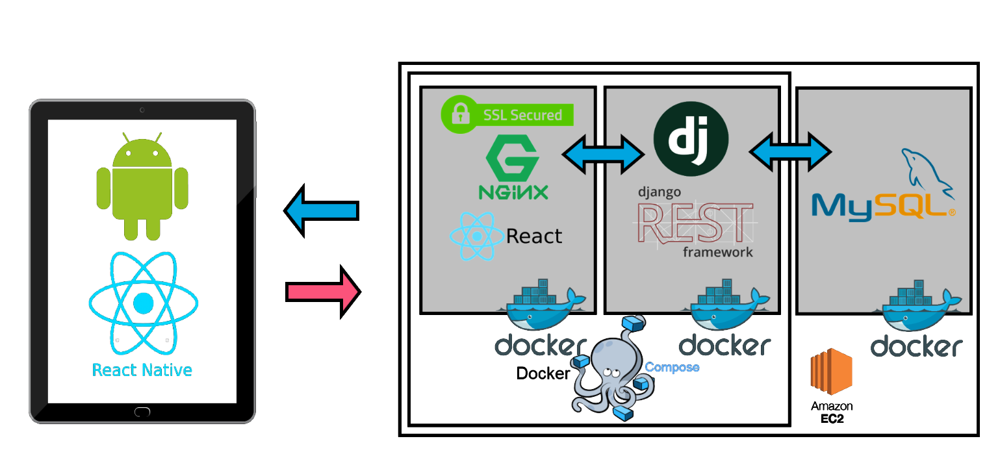
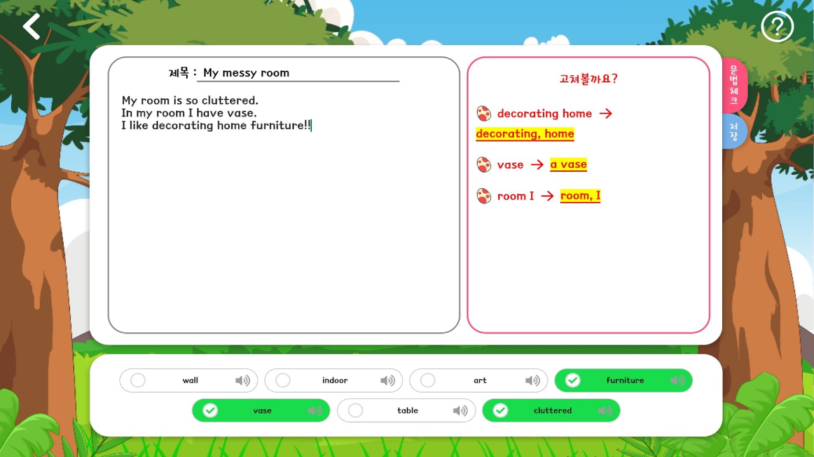
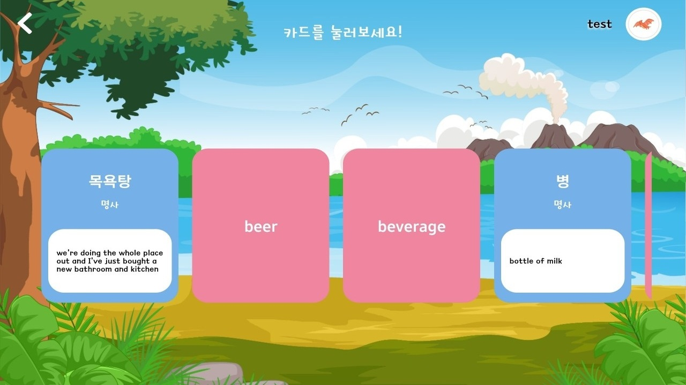
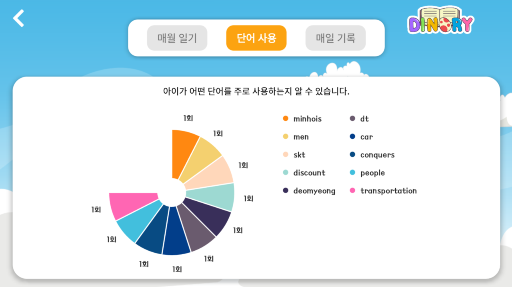

# 🥇 SSAFY 4기 특화프로젝트 1등 수상


## YOUTUBE LINK 
- https://www.youtube.com/watch?v=G4HGE65g3mg
## PlayStore LINK 
- https://play.google.com/store/apps/details?id=com.DINORY

## Table of Contents

- [❓ **About Dinory**](#about-dinory)

- [💻 **Getting start**](#getting-start)
- [🧩 **Main Functionalities**](#main-functionalities)

- [🔨 **Built With**](#built-with)
- [👨‍👩‍👧‍👧 **Our Team**](#our-team)

-------------------------

#### ❓ **About Dinory**


**Dinory는 AI를 활용하여 일상 사진을 업로드해 영어 단어를 추출해주고 이를 활용하여 영어로 일기를 써서 학습하는 인공지능 영어 사진일기 앱입니다.**

**자신이 올린 사진 이미지를 활용해 영어 단어를 학습하고, 단어를 올바르게 문장에서 활용할 수 있도록 하는 것이 다이노리의 목표입니다.**

 

#### 💻 **Getting start**

**Backend**

- **start with Docker**

  - django

  - nginx

    ```
    $ docker-compose up -d --buld
    ```

  - TTS server

    ```
    $ cd AI/
    $ docker run -it -p 5002:5002 synesthesiam/mozillatts:en
    ```

- **in Local**

  ```
  $ cd Backend/
  $ pip install -r requirements.txt
  ```

- **설치시 오류발생**

  - ./Backend/requirements.txt 파일내 uwsgi 를 주석처리한 후 다시 실행해주세요.

- **설치완료 후 ntlk 오류 발생**

  - ntlk.download() 를 진행해주세요.

    

**Frontend**

- **Play store**

  https://play.google.com/store/apps/details?id=com.DINORY

- **Local**

  - 안드로이드 설치 후 가상 에뮬레이터 설정 (https://developer.android.com/studio/install?hl=ko)

  ```
  $ cd Frontend/
  $ yarn install
  $ yarun run android (react-native run android)
  ```

  

#### 🧩 **Main Functionalities**

**SignIn**

- 자동로그인
- 아이디 저장

**SignUp**

- 이메일 인증
- 아이디 중복 체크
- 비밀번호 확인, 핀번호 생성

**Profile**

- 다중 계정 생성 
- 이름/나이/캐릭터 선택 및 변경 기능

**Main**

- bgm 음소거
- navigation

**Diary**

- 첫 일기 작성시 Tutorial 실행
- Tutorial 다시보기
- 사진 촬영 및 갤러리에서 가지고 오기
- 이미지 캡셔닝
- 단어 TTS,  뜻 제공
- 단어장 추가 기능
- 일기 작성 시 자동 저장(debounce활용)
- 문법 체크 및 오류 제공

**Word**

- 알파벳별 추가한 단어 보기
- 단어  TTS, 뜻 및 예문 보기

**DiaryList**

- 작성한 일기 조회
- 검사된 일기 확인 (도장 유무)

**Setting**

- 핀번호 인증

- 목소리 변경(TTS)
- 핀번호, 비밀번호, profile 변경
- 통계 보기
- 일기 검사
- 로그아웃


⭐ **Front-end** :     

⭐ **Back-end** :   

⭐ **Common** :   



🚀 **ERD**


#### 👨‍👩‍👧‍👧 **Our Team**

|    이름    | 직책 |                            역할                            |
| :--------: | :--: | :--------------------------------------------------------: |
| **명도균** | 팀장 |       Frontend(앱 개발), 기획 ,UCC 제작, README 작성       |
| **신민호** | 팀원 |               Frontend(앱 개발), 회의록관리                |
| **유진우** | 팀원 |           Frontend(앱 개발), Git master, Design            |
| **윤지해** | 팀원 |              Frontend(앱 개발), QA, JIRA 관리              |
| **장수민** | 팀원 |                    Backend(DB), AWS관리                    |
| **전의수** | 팀원 | Backend (AI), Frontend(앱 소개 페이지), 테크리더, UCC 제작 |


#### 📌 개발 규칙

📝 **Commit message**

```
예시 :

[feat/FE] : 제목
##### 제목은 최대 50 글자까지만 입력 ############## -> |
내용
######## 본문은 한 줄에 최대 72 글자까지만 입력 ########################### -> |
```

```
feat       : 새로운 기능 추가
fix        : 버그 수정
refactor   : 코드 리팩토링
style      : 코드 포맷팅, 세미콜론 누락, 코드 변경이 없는 경우
docs       : 문서 수정
test       : 테스트 코드, 리팩토링 테스트 코드 추가
chore      : 빌드 업무 수정, 패키지 매니저 수정
 ------------------
#     제목 첫 글자를 대문자로
#     제목은 명령문으로
#     제목 끝에 마침표(.) 금지
#     제목과 본문을 한 줄 띄워 분리하기
#     본문은 "어떻게" 보다 "무엇을", "왜"를 설명한다.
#     본문에 여러줄의 메시지를 작성할 땐 "-"로 구분
```

🌲 **Branch**

- **master**

- **develop**

- 문서일 경우 : docs/[name]-[status]

- 수정할 경우 : hotfix/[part]-[name]

- 기능 : feature/[part]-[name]-[status]

  - \*part : FE or BE

  - \*name : 기능 등 자유

  - \*status : 기능을 한 번에 완성하지 못했을 경우 추가로 할 때

    (ex. init, second, processing, end)

💻 **Code**

- **전체 format**
  
  - ESLint, prettier 사용
- naming
  - Django(Python)
    - Snake case (ex. snake_case) : 변수, 함수, 메소드
    - Pascal case (ex. PascalCase) : 클래스
  - React-native
    - Pascal case (ex. PascalCase) : 클래스
    - Camel case (ex. camelCase) : 기타
    
    

#### 📷 Gallery








